## Índice

0. [Ficha del proyecto](#0-ficha-del-proyecto)
1. [Descripción general del producto](#1-descripción-general-del-producto)
2. [Arquitectura del sistema](#2-arquitectura-del-sistema)
3. [Modelo de datos](#3-modelo-de-datos)
4. [Especificación de la API](#4-especificación-de-la-api)
5. [Historias de usuario](#5-historias-de-usuario)
6. [Tickets de trabajo](#6-tickets-de-trabajo)
7. [Pull requests](#7-pull-requests)

---

## 0. Ficha del proyecto

### **0.1. Tu nombre completo:** Pablo Umaña Recabarren

### **0.2. Nombre del proyecto:** Sistema de Diseño y Generación de Documentos PD

### **0.3. Descripción breve del proyecto:** Sistema que permite el diseño y generación de archivos PDF que seran utilizados como plantillas para otros documentos. Además proveera una API para la generación de documentos.

---

## 1. Descripción general del producto

## Documento de Especificación Técnica

### 1. Descripción General del Sistema

El Sistema de Diseño y Generación de Documentos PDF es una solución web empresarial diseñada para la creación, gestión y generación automatizada de documentos en formato PDF. El sistema está especialmente orientado a la gestión de documentos gubernamentales, proporcionando capacidades avanzadas de personalización mediante un sistema de plantillas y variables dinámicas.

### 2. Objetivos del Sistema

#### 2.1 Objetivo General

Proporcionar una plataforma robusta y flexible para el diseño, gestión y generación automatizada de documentos PDF, facilitando la creación y mantenimiento de plantillas documentales con soporte para contenido dinámico y preparación para firma electrónica.

#### 2.2 Objetivos Específicos

-   Implementar un sistema de diseño de plantillas con capacidad de personalización modular
-   Proporcionar una interfaz de programación (API) para la generación automatizada de documentos
-   Gestionar el versionamiento de plantillas de manera eficiente
-   Asegurar la trazabilidad completa de los documentos generados
-   Facilitar la preparación de documentos para procesos de firma electrónica

### 3. Alcance del Sistema

#### 3.1 Incluido en el Alcance

-   Diseño y gestión de plantillas documentales
-   Sistema de variables dinámicas para personalización de documentos
-   API REST para generación automatizada de documentos
-   Gestión de versiones de plantillas
-   Sistema de autenticación y autorización
-   Registro de auditoría de operaciones
-   Preparación de documentos para firma electrónica
-   Gestión de recursos visuales (imágenes, logos)

#### 3.2 Fuera del Alcance

-   Proceso de firma electrónica avanzada
-   Almacenamiento permanente de documentos generados
-   Integración directa con sistemas de gestión documental
-   Procesamiento de documentos en formatos diferentes a PDF
-   Verificación de firmas electrónicas
-   Gestión de flujos de trabajo documentales

### 4. Usuarios del Sistema

#### 4.1 Tipos de Usuarios

1. **Administradores del Sistema**

    - Gestión completa de usuarios y permisos
    - Configuración general del sistema
    - Acceso a registros de auditoría

2. **Diseñadores de Plantillas**

    - Creación y modificación de plantillas
    - Gestión de variables y recursos
    - Pruebas de generación de documentos

3. **Usuarios API**
    - Consumo de servicios de generación de documentos
    - Acceso a histórico de documentos generados

### 5. Características Técnicas Principales

#### 5.1 Arquitectura General

-   Aplicación web basada en arquitectura de microservicios
-   Frontend SPA (Single Page Application)
-   Backend REST API
-   Base de datos relacional
-   Sistema de almacenamiento para recursos

#### 5.2 Tecnologías Principales

-   **Frontend**: Framework moderno (React/Vue.js)
-   **Backend**: Framework empresarial (.NET Core/Java Spring Boot)
-   **Base de Datos**: Sistema relacional (PostgreSQL/SQL Server)
-   **API**: REST con documentación OpenAPI/Swagger 3.x.x

#### 5.3 Rendimiento y Escalabilidad

-   Tiempo máximo de generación de documentos: 10 segundos
-   Capacidad de procesamiento: >10 documentos/día
-   Soporte para concurrencia básica (2-5 usuarios simultáneos)
-   Tamaño máximo de recursos: 1MB por imagen

### 6. Requisitos No Funcionales

#### 6.1 Seguridad

-   Autenticación basada en tokens
-   Autorización basada en roles
-   API Keys para acceso a servicios
-   Registro de auditoría de operaciones críticas
-   Cifrado de comunicaciones mediante TLS

#### 6.2 Disponibilidad y Respaldo

-   Disponibilidad en horario laboral
-   Sistema de respaldo diario de datos
-   Recuperación ante fallos básica

#### 6.3 Usabilidad

-   Interfaz de usuario intuitiva
-   Documentación de usuario completa
-   Mensajes de error claros y orientativos
-   Compatibilidad con navegadores modernos

#### 6.4 Mantenibilidad

-   Código fuente documentado
-   Logs de operación y error
-   Documentación técnica actualizada
-   Versionamiento de componentes

### 7. Restricciones Técnicas

-   Tamaño máximo de imágenes: 1MB
-   Formato de documentos: Solo PDF
-   Navegadores soportados: Versiones actuales de Chrome, Firefox, Safari, Edge
-   Tiempo máximo de generación de documentos: 10 segundos
-   Limitaciones de API: Basadas en cuotas por API Key

### 8. Dependencias

-   Sistema de almacenamiento para recursos estáticos
-   Servidor de base de datos relacional
-   Servicios de red con acceso a Internet
-   Infraestructura de respaldo

### 9. Supuestos y Premisas

-   Disponibilidad de infraestructura adecuada
-   Acceso a recursos técnicos necesarios
-   Disponibilidad de personal técnico calificado
-   Estabilidad en los requerimientos base

### 10. Diagrama de secuencia

```mermaid
sequenceDiagram
    participant D as Diseñador
    participant UI as Interface Usuario
    participant TE as Template Editor
    participant API as API Gateway
    participant TV as Template Validator
    participant TM as Template Manager
    participant DB as Database
    participant FS as File Storage
    participant AL as Audit Logger

    %% Inicio de sesión del diseñador
    D->>UI: Acceder al editor
    UI->>API: Validar sesión
    API-->>UI: Sesión válida

    %% Crear nueva plantilla
    D->>UI: Crear nueva plantilla
    UI->>TE: Iniciar editor
    TE-->>UI: Editor inicializado

    %% Configuración básica
    D->>UI: Ingresar metadata
    Note over D,UI: Nombre, descripción, tipo de documento

    %% Diseño de estructura
    D->>TE: Diseñar estructura
    Note over D,TE: Definir secciones<br/>header, body, footer

    %% Agregar recursos
    D->>UI: Cargar imagen/logo
    UI->>API: Validar imagen
    Note over UI,API: Verificar tamaño <= 1MB
    API-->>UI: Imagen válida
    UI->>FS: Almacenar imagen
    FS-->>UI: URL recurso

    %% Definir variables
    D->>TE: Definir variables
    Note over D,TE: Crear variables:<br/>{destinatario}, {fecha}, etc
    TE->>TV: Validar sintaxis
    TV-->>TE: Sintaxis correcta

    %% Preview del documento
    D->>UI: Solicitar preview
    UI->>API: Generar preview
    API->>TM: Procesar plantilla
    TM->>TV: Validar plantilla
    TV-->>TM: Plantilla válida
    TM-->>API: Preview generado
    API-->>UI: Mostrar preview
    UI-->>D: Visualizar preview

    %% Guardar plantilla
    D->>UI: Guardar plantilla
    UI->>API: Request guardar
    API->>TV: Validación final
    TV->>TM: Procesar guardado

    par Guardado paralelo
        TM->>DB: Guardar metadata
        TM->>FS: Guardar contenido
        TM->>AL: Registrar creación
    end

    TM-->>API: Guardado exitoso
    API-->>UI: Confirmación
    UI-->>D: Plantilla guardada

    %% Activar plantilla
    D->>UI: Activar plantilla
    UI->>API: Request activación
    API->>TM: Activar plantilla
    TM->>DB: Actualizar estado
    TM->>AL: Registrar activación
    TM-->>API: Activación exitosa
    API-->>UI: Confirmación
    UI-->>D: Plantilla activa

    %% Control de versiones
    Note over D,AL: La plantilla queda<br/>versionada como v1.0

```

Este diagrama detalla el flujo completo del proceso de diseño de plantillas, incluyendo:

1. **Fase Inicial**:

    - Acceso al sistema
    - Inicio del editor
    - Configuración básica

2. **Fase de Diseño**:

    - Estructura del documento
    - Carga de recursos
    - Definición de variables
    - Validaciones en tiempo real

3. **Fase de Preview**:

    - Generación de vista previa
    - Validaciones de estructura

4. **Fase de Guardado**:

    - Validación final
    - Guardado paralelo de datos
    - Registro de auditoría

5. **Fase de Activación**:
    - Activación de la plantilla
    - Control de versiones

---

## 2. Arquitectura del Sistema

# Stack Tecnológico y Arquitectura AWS

## Stack Tecnológico

### Frontend

-   **NextJS 15.x**

    -   Framework de React para desarrollo web
    -   Renderizado híbrido (estático y del lado del servidor)
    -   Optimización automática de imágenes y assets
    -   Enrutamiento basado en sistema de archivos
    -   Soporte para API Routes

-   **Node 20.x**
    -   Runtime de JavaScript moderno
    -   Soporte para ESM (ECMAScript Modules)
    -   Mejoras significativas en rendimiento
    -   Gestión de memoria optimizada

### Backend

-   **Python 3.9.x**

    -   Lenguaje de programación de alto nivel
    -   Soporte para tipado estático
    -   Excelente manejo de dependencias
    -   Gran ecosistema de librerías

-   **Flask**

    -   Framework web ligero y flexible
    -   Fácil integración con extensiones
    -   Ideal para microservicios
    -   Buen rendimiento para APIs REST

-   **Docker**
    -   Containerización de aplicaciones
    -   Consistencia entre ambientes
    -   Fácil escalamiento
    -   Gestión eficiente de recursos

### Base de Datos

-   **PostgreSQL**
    -   Sistema de gestión de base de datos relacional
    -   Robusto y confiable
    -   Soporte para JSON y otros tipos complejos
    -   Excelente rendimiento para operaciones complejas

## Servicios AWS

### Almacenamiento y Distribución

-   **S3 (Simple Storage Service)**

    -   Almacenamiento del frontend estático
    -   Alta disponibilidad y durabilidad
    -   Integración con CloudFront
    -   Versionamiento de archivos

-   **CloudFront**
    -   CDN para distribución global
    -   Caché de contenido estático
    -   Reducción de latencia
    -   Certificados SSL/TLS integrados

### Computación y Contenedores

-   **ECS (Elastic Container Service)**

    -   Orquestación de contenedores Docker
    -   Escalamiento automático
    -   Integración con otros servicios AWS
    -   Gestión de despliegues

-   **ELB (Elastic Load Balancer)**
    -   Distribución de tráfico
    -   Health checks
    -   SSL/TLS termination
    -   Integración con Auto Scaling

### CI/CD

-   **CodePipeline**

    -   Automatización de despliegues
    -   Integración continua
    -   Pipeline de múltiples etapas
    -   Gestión de releases

-   **CodeBuild**
    -   Compilación y testing
    -   Construcción de imágenes Docker
    -   Integración con CodePipeline
    -   Entorno de build personalizable

### Base de Datos

-   **RDS (Relational Database Service)**
    -   PostgreSQL gestionado
    -   Backups automáticos
    -   Alta disponibilidad
    -   Parches y mantenimiento automatizado

### Infraestructura como Código

-   **CloudFormation**
    -   Definición de infraestructura como código
    -   Gestión de recursos AWS
    -   Plantillas reutilizables
    -   Control de versiones de infraestructura

### DNS y Dominio

-   **Route53**
    -   Gestión de DNS
    -   Routing policies avanzado
    -   Health checks
    -   Integración con otros servicios AWS

### Diagrama

´´´python from diagrams import Diagram, Cluster from diagrams.aws.compute import ECS, ElasticContainerService from diagrams.aws.database import RDS from diagrams.aws.network import ELB, CloudFront, Route53 from diagrams.aws.storage import S3 from diagrams.aws.devtools import CodeBuild, CodePipeline from diagrams.aws.management import Cloudformation

with Diagram("Arquitectura AWS - Sistema de Generación de PDFs", show=False, direction="LR"):

    # DNS y CDN
    dns = Route53("Route 53")
    cdn = CloudFront("CloudFront")

    with Cluster("Frontend"):
        s3 = S3("Static Website")

    # Pipeline de CI/CD
    with Cluster("CI/CD Pipeline"):
        pipeline = CodePipeline("CodePipeline")
        build = CodeBuild("CodeBuild")

    # Servicios de Backend
    with Cluster("Backend Services"):
        lb = ELB("Load Balancer")
        with Cluster("ECS Cluster"):
            services = [
                ECS("API Service 1"),
                ECS("API Service 2"),
                ECS("API Service 3")
            ]

    # Base de Datos
    with Cluster("Database"):
        db = RDS("PostgreSQL")

    # Infraestructura como Código
    cfn = Cloudformation("CloudFormation")

    # Conexiones
    dns >> cdn >> s3
    dns >> lb >> services
    pipeline >> build
    build >> s3
    build >> services

    for service in services:
        service >> db

    cfn - [s3, lb, db]  # CloudFormation gestiona estos recursos

´´´

El diagrama muestra la arquitectura completa del sistema, destacando:

1. Capa de Acceso

Route53 como punto de entrada CloudFront para distribución de contenido estático ELB para balanceo de APIs

2. Capa de Aplicación

Frontend en S3 Servicios en contenedores ECS Pipeline de CI/CD

3. Capa de Datos

RDS PostgreSQL

4. Gestión de Infraestructura

CloudFormation para IaC

---

## 3. Modelo de Datos

### **3.1. Diagrama del modelo de datos:**

### **3.2. Descripción de entidades principales:**

# Diccionario de Datos - Sistema de Generación de PDFs

## 1. Gestión de Usuarios y Seguridad

### 1.1 Users

Almacena la información de los usuarios del sistema.

| Campo         | Tipo         | Descripción                     | Restricciones             |
| ------------- | ------------ | ------------------------------- | ------------------------- |
| user_id       | BIGINT       | Identificador único del usuario | PK, NOT NULL              |
| username      | VARCHAR(50)  | Nombre de usuario               | UNIQUE, NOT NULL          |
| email         | VARCHAR(100) | Correo electrónico              | UNIQUE, NOT NULL          |
| password_hash | VARCHAR(255) | Hash de la contraseña           | NOT NULL                  |
| is_active     | BOOLEAN      | Estado del usuario              | DEFAULT true              |
| created_at    | TIMESTAMP    | Fecha de creación               | DEFAULT CURRENT_TIMESTAMP |
| updated_at    | TIMESTAMP    | Fecha de actualización          | DEFAULT CURRENT_TIMESTAMP |

### 1.2 Roles

Define los roles disponibles en el sistema.

| Campo       | Tipo         | Descripción                 | Restricciones    |
| ----------- | ------------ | --------------------------- | ---------------- |
| role_id     | BIGINT       | Identificador único del rol | PK, NOT NULL     |
| name        | VARCHAR(50)  | Nombre del rol              | UNIQUE, NOT NULL |
| description | VARCHAR(255) | Descripción del rol         |                  |
| is_active   | BOOLEAN      | Estado del rol              | DEFAULT true     |

### 1.3 UserRoles

Relaciona usuarios con roles (tabla de unión).

| Campo       | Tipo      | Descripción         | Restricciones             |
| ----------- | --------- | ------------------- | ------------------------- |
| user_id     | BIGINT    | ID del usuario      | FK -> Users, NOT NULL     |
| role_id     | BIGINT    | ID del rol          | FK -> Roles, NOT NULL     |
| assigned_at | TIMESTAMP | Fecha de asignación | DEFAULT CURRENT_TIMESTAMP |

### 1.4 ApiKeys

Gestiona las claves de API para acceso a servicios.

| Campo       | Tipo         | Descripción                | Restricciones             |
| ----------- | ------------ | -------------------------- | ------------------------- |
| api_key_id  | BIGINT       | ID único de la API key     | PK, NOT NULL              |
| user_id     | BIGINT       | ID del usuario propietario | FK -> Users, NOT NULL     |
| key_value   | VARCHAR(100) | Valor de la API key        | UNIQUE, NOT NULL          |
| description | VARCHAR(255) | Descripción del uso        |                           |
| is_active   | BOOLEAN      | Estado de la API key       | DEFAULT true              |
| created_at  | TIMESTAMP    | Fecha de creación          | DEFAULT CURRENT_TIMESTAMP |
| expires_at  | TIMESTAMP    | Fecha de expiración        |                           |

## 2. Gestión de Plantillas

### 2.1 TemplateCategories

Categorización de plantillas.

| Campo       | Tipo         | Descripción            | Restricciones    |
| ----------- | ------------ | ---------------------- | ---------------- |
| category_id | BIGINT       | ID único de categoría  | PK, NOT NULL     |
| name        | VARCHAR(100) | Nombre de la categoría | UNIQUE, NOT NULL |
| description | VARCHAR(255) | Descripción            |                  |
| is_active   | BOOLEAN      | Estado de la categoría | DEFAULT true     |

### 2.2 Templates

Almacena las plantillas base del sistema.

| Campo       | Tipo         | Descripción              | Restricciones             |
| ----------- | ------------ | ------------------------ | ------------------------- |
| template_id | BIGINT       | ID único de la plantilla | PK, NOT NULL              |
| category_id | BIGINT       | ID de la categoría       | FK -> TemplateCategories  |
| name        | VARCHAR(100) | Nombre de la plantilla   | UNIQUE, NOT NULL          |
| description | TEXT         | Descripción detallada    |                           |
| is_active   | BOOLEAN      | Estado de la plantilla   | DEFAULT true              |
| created_at  | TIMESTAMP    | Fecha de creación        | DEFAULT CURRENT_TIMESTAMP |
| created_by  | BIGINT       | ID del usuario creador   | FK -> Users, NOT NULL     |
| updated_at  | TIMESTAMP    | Fecha de actualización   | DEFAULT CURRENT_TIMESTAMP |
| updated_by  | BIGINT       | ID del último editor     | FK -> Users, NOT NULL     |

### 2.3 TemplateVersions

Gestiona las diferentes versiones de cada plantilla.

| Campo          | Tipo      | Descripción               | Restricciones             |
| -------------- | --------- | ------------------------- | ------------------------- |
| version_id     | BIGINT    | ID único de la versión    | PK, NOT NULL              |
| template_id    | BIGINT    | ID de la plantilla        | FK -> Templates, NOT NULL |
| version_number | INTEGER   | Número de versión         | NOT NULL                  |
| content        | TEXT      | Contenido de la plantilla | NOT NULL                  |
| is_active      | BOOLEAN   | Estado de la versión      | DEFAULT true              |
| created_at     | TIMESTAMP | Fecha de creación         | DEFAULT CURRENT_TIMESTAMP |
| created_by     | BIGINT    | ID del usuario creador    | FK -> Users, NOT NULL     |

### 2.4 TemplateResources

Almacena los recursos asociados a las plantillas.

| Campo         | Tipo         | Descripción                          | Restricciones             |
| ------------- | ------------ | ------------------------------------ | ------------------------- |
| resource_id   | BIGINT       | ID único del recurso                 | PK, NOT NULL              |
| template_id   | BIGINT       | ID de la plantilla                   | FK -> Templates, NOT NULL |
| resource_type | VARCHAR(50)  | Tipo de recurso (imagen, logo, etc.) | NOT NULL                  |
| resource_path | VARCHAR(255) | Ruta de almacenamiento               | NOT NULL                  |
| original_name | VARCHAR(255) | Nombre original del archivo          | NOT NULL                  |
| size_bytes    | INTEGER      | Tamaño del archivo en bytes          | NOT NULL                  |
| created_at    | TIMESTAMP    | Fecha de creación                    | DEFAULT CURRENT_TIMESTAMP |

### 2.5 TemplateVariables

Define las variables utilizadas en las plantillas.

| Campo            | Tipo         | Descripción                             | Restricciones             |
| ---------------- | ------------ | --------------------------------------- | ------------------------- |
| variable_id      | BIGINT       | ID único de la variable                 | PK, NOT NULL              |
| template_id      | BIGINT       | ID de la plantilla                      | FK -> Templates, NOT NULL |
| name             | VARCHAR(50)  | Nombre de la variable                   | NOT NULL                  |
| default_value    | VARCHAR(255) | Valor por defecto                       |                           |
| required         | BOOLEAN      | Si es obligatoria                       | DEFAULT false             |
| variable_type    | VARCHAR(50)  | Tipo de variable (texto, número, fecha) | NOT NULL                  |
| validation_rules | TEXT         | Reglas de validación en JSON            |                           |

### 2.6 TemplatePermissions

Gestiona los permisos de acceso a las plantillas.

| Campo         | Tipo    | Descripción              | Restricciones             |
| ------------- | ------- | ------------------------ | ------------------------- |
| permission_id | BIGINT  | ID único del permiso     | PK, NOT NULL              |
| template_id   | BIGINT  | ID de la plantilla       | FK -> Templates, NOT NULL |
| role_id       | BIGINT  | ID del rol               | FK -> Roles, NOT NULL     |
| can_view      | BOOLEAN | Permiso de visualización | DEFAULT false             |
| can_edit      | BOOLEAN | Permiso de edición       | DEFAULT false             |
| can_generate  | BOOLEAN | Permiso de generación    | DEFAULT false             |

### 2.7 TemplateSignatureConfig

Configuración de firmas para las plantillas.

| Campo              | Tipo      | Descripción                       | Restricciones             |
| ------------------ | --------- | --------------------------------- | ------------------------- |
| config_id          | BIGINT    | ID de la configuración            | PK, NOT NULL              |
| template_id        | BIGINT    | ID de la plantilla                | FK -> Templates, NOT NULL |
| signature_count    | INTEGER   | Número de firmas requeridas       | DEFAULT 0                 |
| coordinates_json   | TEXT      | Coordenadas de las firmas en JSON |                           |
| require_sequential | BOOLEAN   | Si requiere firma secuencial      | DEFAULT false             |
| updated_at         | TIMESTAMP | Fecha de última actualización     | DEFAULT CURRENT_TIMESTAMP |

## 3. Gestión de Documentos Generados

### 3.1 GeneratedDocuments

Registro de documentos generados.

| Campo          | Tipo         | Descripción                  | Restricciones                    |
| -------------- | ------------ | ---------------------------- | -------------------------------- |
| document_id    | BIGINT       | ID único del documento       | PK, NOT NULL                     |
| template_id    | BIGINT       | ID de la plantilla           | FK -> Templates, NOT NULL        |
| version_id     | BIGINT       | ID de la versión             | FK -> TemplateVersions, NOT NULL |
| generated_by   | BIGINT       | ID del usuario generador     | FK -> Users, NOT NULL            |
| variables_json | TEXT         | Variables utilizadas en JSON | NOT NULL                         |
| status         | VARCHAR(50)  | Estado del documento         | NOT NULL                         |
| output_path    | VARCHAR(255) | Ruta del documento generado  |                                  |
| created_at     | TIMESTAMP    | Fecha de creación            | DEFAULT CURRENT_TIMESTAMP        |
| completed_at   | TIMESTAMP    | Fecha de completación        |                                  |

### 3.2 DocumentQueue

Cola de procesamiento de documentos.

| Campo         | Tipo        | Descripción                 | Restricciones                      |
| ------------- | ----------- | --------------------------- | ---------------------------------- |
| queue_id      | BIGINT      | ID único en la cola         | PK, NOT NULL                       |
| document_id   | BIGINT      | ID del documento            | FK -> GeneratedDocuments, NOT NULL |
| status        | VARCHAR(50) | Estado en la cola           | NOT NULL                           |
| error_message | TEXT        | Mensaje de error            |                                    |
| retry_count   | INTEGER     | Número de reintentos        | DEFAULT 0                          |
| next_retry    | TIMESTAMP   | Fecha del próximo reintento |                                    |
| created_at    | TIMESTAMP   | Fecha de creación           | DEFAULT CURRENT_TIMESTAMP          |

## 4. Configuración y Auditoría

### 4.1 SystemSettings

Configuraciones globales del sistema.

| Campo       | Tipo         | Descripción                     | Restricciones             |
| ----------- | ------------ | ------------------------------- | ------------------------- |
| setting_id  | BIGINT       | ID de la configuración          | PK, NOT NULL              |
| key         | VARCHAR(100) | Clave de configuración          | UNIQUE, NOT NULL          |
| value       | TEXT         | Valor de la configuración       | NOT NULL                  |
| value_type  | VARCHAR(50)  | Tipo de valor                   | NOT NULL                  |
| description | TEXT         | Descripción de la configuración |                           |
| updated_at  | TIMESTAMP    | Fecha de actualización          | DEFAULT CURRENT_TIMESTAMP |

### 4.2 AuditLogs

Registro de auditoría del sistema.

| Campo        | Tipo         | Descripción                   | Restricciones             |
| ------------ | ------------ | ----------------------------- | ------------------------- |
| log_id       | BIGINT       | ID del registro               | PK, NOT NULL              |
| user_id      | BIGINT       | ID del usuario                | FK -> Users               |
| action       | VARCHAR(100) | Acción realizada              | NOT NULL                  |
| entity_type  | VARCHAR(100) | Tipo de entidad afectada      | NOT NULL                  |
| entity_id    | BIGINT       | ID de la entidad afectada     | NOT NULL                  |
| details_json | TEXT         | Detalles de la acción en JSON |                           |
| created_at   | TIMESTAMP    | Fecha de creación             | DEFAULT CURRENT_TIMESTAMP |
| ip_address   | VARCHAR(45)  | Dirección IP del usuario      |                           |

---

## 4. Especificación de la API

> Si tu backend se comunica a través de API, describe los endpoints principales (máximo 3) en formato OpenAPI. Opcionalmente puedes añadir un ejemplo de petición y de respuesta para mayor claridad

---

## 5. Historias de Usuario

# Historias de Usuario - Sistema de Generación de PDFs

## Épica 1: Gestión de Variables

### HU-01: Creación de Variables Personalizadas

**Como** administrador de plantillas **Quiero** crear variables personalizadas **Para** utilizarlas posteriormente en las plantillas de documentos

**Criterios de Aceptación:**

1. Puedo crear una variable especificando:
    - Nombre único
    - Tipo de dato (texto, número, fecha, etc.)
    - Valor por defecto (opcional)
    - Reglas de validación
2. El sistema valida que el nombre de la variable sea único
3. Puedo marcar la variable como requerida u opcional
4. Se pueden crear variables con formato específico (ej: RUT, email, moneda)
5. Las variables creadas quedan disponibles inmediatamente

### HU-02: Gestión de Variables Predefinidas

**Como** administrador de plantillas **Quiero** acceder a un conjunto de variables predefinidas del sistema **Para** utilizar datos comunes en las plantillas

**Criterios de Aceptación:**

1. Tengo acceso a variables predefinidas como:
    - Fecha actual (en diferentes formatos)
    - Hora actual
    - Usuario actual
    - Datos de la organización
2. Puedo ver la descripción y formato de cada variable predefinida
3. No puedo modificar las variables predefinidas del sistema

## Épica 2: Diseño de Plantillas

### HU-03: Creación de Plantillas por Secciones

**Como** diseñador de documentos **Quiero** crear plantillas divididas en secciones **Para** mantener una estructura organizada y reutilizable

**Criterios de Aceptación:**

1. Puedo crear una plantilla con:
    - Encabezado personalizable
    - Cuerpo dividido en múltiples secciones
    - Pie de página personalizable
2. Cada sección puede ser:
    - Reordenada mediante drag & drop
    - Duplicada
    - Eliminada
3. Se guarda automáticamente el trabajo en progreso
4. Puedo previsualizar la plantilla completa

### HU-04: Inserción de Contenido en Plantillas

**Como** diseñador de documentos **Quiero** insertar diferentes tipos de contenido en las secciones **Para** crear documentos con información variada

**Criterios de Aceptación:**

1. Puedo insertar:
    - Texto estático con formato (negrita, cursiva, subrayado)
    - Variables personalizadas y predefinidas
    - Imágenes (con límite de 1MB)
    - Tablas
2. Al insertar una variable:
    - Se muestra un selector con las variables disponibles
    - Se visualiza el formato en que se mostrará
3. Para las imágenes:
    - Puedo redimensionarlas
    - Puedo alinearlas (izquierda, centro, derecha)
4. El sistema valida el peso de las imágenes antes de subirlas

### HU-05: Configuración de Áreas de Firma

**Como** diseñador de documentos **Quiero** definir áreas para firma en el documento **Para** especificar dónde se ubicarán las firmas

**Criterios de Aceptación:**

1. Puedo:
    - Definir múltiples áreas de firma
    - Especificar el orden de las firmas
    - Establecer el tamaño del área de firma
2. Para cada área de firma puedo definir:
    - Título o cargo del firmante
    - Si es obligatoria u opcional
    - Orden en la secuencia de firmas
3. Se visualiza una previsualización de cómo se verá el área de firma

## Épica 3: Generación de Documentos

### HU-06: Generación de Documentos vía API

**Como** desarrollador integrador **Quiero** generar documentos mediante una API REST **Para** automatizar la creación de documentos desde otros sistemas

**Criterios de Aceptación:**

1. Puedo enviar una solicitud POST con:
    - ID de la plantilla
    - Versión de la plantilla (opcional)
    - Valores para las variables
2. La API valida:
    - La existencia de la plantilla
    - Que todas las variables requeridas tengan valor
    - El formato de los valores según el tipo de variable
3. Recibo como respuesta:
    - El documento en formato Base64
    - Metadata del documento generado
4. Se registra cada generación de documento para auditoría

### HU-07: Estampado de Firmas

**Como** desarrollador integrador **Quiero** estampar firmas en documentos generados **Para** completar el proceso de firma digital

**Criterios de Aceptación:**

1. Puedo enviar una solicitud POST con:
    - ID del documento
    - Datos de la firma
    - Posición de la firma (si hay múltiples áreas)
2. El sistema verifica:
    - Que el documento existe y está pendiente de firma
    - Que el área de firma especificada está disponible
    - El orden correcto si las firmas son secuenciales
3. La firma se estampa en la posición correcta
4. Se registra la acción de firma en el log de auditoría

### HU-08: Consulta de Estado de Documentos

**Como** usuario del sistema **Quiero** consultar el estado de los documentos generados **Para** hacer seguimiento del proceso de firma

**Criterios de Aceptación:**

1. Puedo consultar:
    - Estado actual del documento
    - Lista de firmas pendientes
    - Historial de firmas realizadas
2. La información incluye:
    - Fecha y hora de generación
    - Fecha y hora de cada firma
    - Usuarios que han firmado
3. Puedo filtrar documentos por:
    - Estado
    - Fecha de generación
    - Plantilla utilizada

---

## 6. Tickets de Trabajo

## Épica 1: Configuración Inicial del Proyecto

### TICK-001: Setup del Proyecto Frontend

**Prioridad:** Alta **Estimación:** 3 puntos **Tipo:** Técnico

**Tareas:**

1. Inicializar proyecto NextJS 15
2. Configurar TypeScript
3. Configurar ESLint y Prettier
4. Implementar estructura base de carpetas
5. Configurar rutas base
6. Configurar sistema de autenticación
7. Configurar sistema de estilos (TailwindCSS)

### TICK-002: Setup del Proyecto Backend

**Prioridad:** Alta **Estimación:** 3 puntos **Tipo:** Técnico

**Tareas:**

1. Inicializar proyecto Flask
2. Configurar entorno virtual Python
3. Configurar estructura de carpetas
4. Implementar conexión a PostgreSQL
5. Configurar sistema de migraciones
6. Configurar autenticación JWT
7. Configurar Swagger/OpenAPI

### TICK-003: Configuración de DevOps

**Prioridad:** Alta **Estimación:** 5 puntos **Tipo:** Técnico

**Tareas:**

1. Configurar repositorios Git
2. Crear Dockerfiles para frontend y backend
3. Configurar docker-compose para desarrollo
4. Configurar CI/CD en AWS CodePipeline
5. Configurar entornos (dev, staging, prod)
6. Implementar scripts de despliegue
7. Configurar monitoreo básico

## Épica 2: Gestión de Variables

### TICK-004: Backend - API de Variables

**Prioridad:** Alta **Estimación:** 5 puntos **Tipo:** Desarrollo

**Tareas:**

1. Implementar modelos de datos para variables
2. Crear endpoints CRUD para variables
3. Implementar validaciones de variables
4. Crear sistema de variables predefinidas
5. Implementar tests unitarios
6. Documentar API en Swagger

### TICK-005: Frontend - Gestión de Variables

**Prioridad:** Alta **Estimación:** 5 puntos **Tipo:** Desarrollo

**Tareas:**

1. Crear interfaz de listado de variables
2. Implementar formulario de creación/edición
3. Desarrollar componente de validación de variables
4. Implementar preview de variables
5. Crear tests de componentes
6. Implementar manejo de errores

## Épica 3: Diseño de Plantillas

### TICK-006: Backend - Sistema de Plantillas

**Prioridad:** Alta **Estimación:** 8 puntos **Tipo:** Desarrollo

**Tareas:**

1. Implementar modelos para plantillas
2. Crear sistema de versionamiento
3. Desarrollar gestión de recursos
4. Implementar validación de plantillas
5. Crear endpoints para CRUD de plantillas
6. Implementar sistema de permisos
7. Crear tests unitarios

### TICK-007: Frontend - Editor de Plantillas

**Prioridad:** Alta **Estimación:** 13 puntos **Tipo:** Desarrollo

**Tareas:**

1. Crear interfaz principal del editor
2. Implementar sistema de secciones
3. Desarrollar herramientas de edición
4. Implementar selector de variables
5. Crear gestor de recursos
6. Implementar preview en tiempo real
7. Desarrollar sistema de guardado automático
8. Crear tests de componentes

### TICK-008: Backend - Gestión de Recursos

**Prioridad:** Media **Estimación:** 5 puntos **Tipo:** Desarrollo

**Tareas:**

1. Implementar sistema de upload de imágenes
2. Crear validación de archivos
3. Implementar almacenamiento en S3
4. Crear sistema de caché de recursos
5. Desarrollar cleanup automático
6. Implementar tests unitarios

## Épica 4: Generación de Documentos

### TICK-009: Backend - Motor de Generación PDF

**Prioridad:** Alta **Estimación:** 13 puntos **Tipo:** Desarrollo

**Tareas:**

1. Implementar sistema base de generación PDF
2. Crear procesador de variables
3. Implementar sistema de estilos
4. Desarrollar manejo de recursos
5. Implementar sistema de cola de procesamiento
6. Crear sistema de cache de plantillas
7. Implementar manejo de errores
8. Crear tests unitarios

### TICK-010: Backend - API de Generación

**Prioridad:** Alta **Estimación:** 8 puntos **Tipo:** Desarrollo

**Tareas:**

1. Crear endpoints de generación
2. Implementar validación de requests
3. Desarrollar sistema de respuestas asíncronas
4. Implementar registro de auditoría
5. Crear documentación de API
6. Implementar rate limiting
7. Crear tests de integración

### TICK-011: Frontend - Panel de Documentos

**Prioridad:** Media **Estimación:** 5 puntos **Tipo:** Desarrollo

**Tareas:**

1. Crear interfaz de listado de documentos
2. Implementar filtros y búsqueda
3. Desarrollar vista de detalles
4. Implementar sistema de descarga
5. Crear componente de historial
6. Desarrollar tests de componentes

## Épica 5: Sistema de Firmas

### TICK-012: Backend - API de Firmas

**Prioridad:** Alta **Estimación:** 8 puntos **Tipo:** Desarrollo

**Tareas:**

1. Implementar modelo de configuración de firmas
2. Crear endpoints de gestión de firmas
3. Desarrollar sistema de posicionamiento
4. Implementar validación de secuencia
5. Crear registro de firmas
6. Implementar tests unitarios

### TICK-013: Frontend - Configurador de Firmas

**Prioridad:** Alta **Estimación:** 8 puntos **Tipo:** Desarrollo

**Tareas:**

1. Crear interfaz de configuración
2. Implementar editor de posiciones
3. Desarrollar preview de firmas
4. Crear gestor de secuencias
5. Implementar validaciones visuales
6. Desarrollar tests de componentes

## Épica 6: Testing y Documentación

### TICK-014: Testing E2E

**Prioridad:** Media **Estimación:** 5 puntos **Tipo:** Testing

**Tareas:**

1. Configurar Cypress
2. Implementar tests de flujos principales
3. Crear tests de casos de error
4. Documentar escenarios de prueba
5. Implementar reportes de cobertura

### TICK-015: Documentación Técnica

**Prioridad:** Media **Estimación:** 3 puntos **Tipo:** Documentación

**Tareas:**

1. Crear documentación de arquitectura
2. Documentar procesos de deployment
3. Crear guías de desarrollo
4. Documentar APIs
5. Crear manuales de usuario

**Estimación total:** 97 puntos

**Consideraciones adicionales:**

-   Las estimaciones están en puntos de historia
-   Prioridad: Alta/Media/Baja
-   Se recomienda desarrollar en orden de prioridad
-   Cada ticket debe incluir sus propios tests
-   La documentación debe actualizarse junto con el desarrollo

¿Te gustaría que profundice en algún aspecto específico como:

1. Desglose más detallado de tareas
2. Dependencias entre tickets
3. Riesgos asociados
4. Criterios de aceptación específicos
5. Estimación temporal?

---

## 7. Pull Requests

> Documenta 3 de las Pull Requests realizadas durante la ejecución del proyecto

**Pull Request 1**

**Pull Request 2**

**Pull Request 3**
